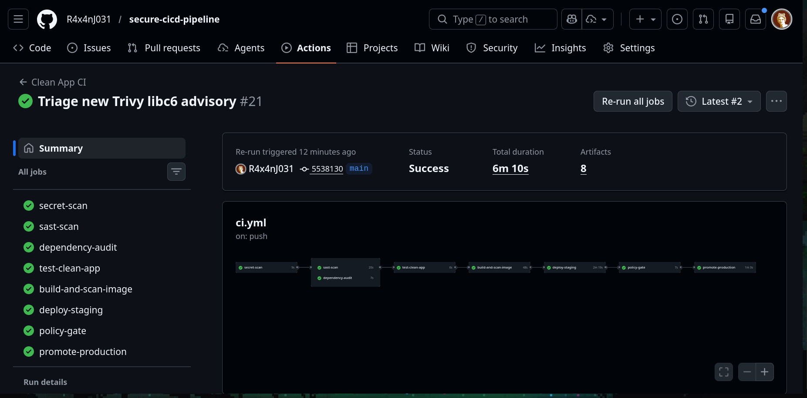
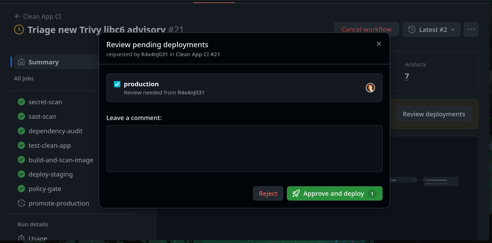
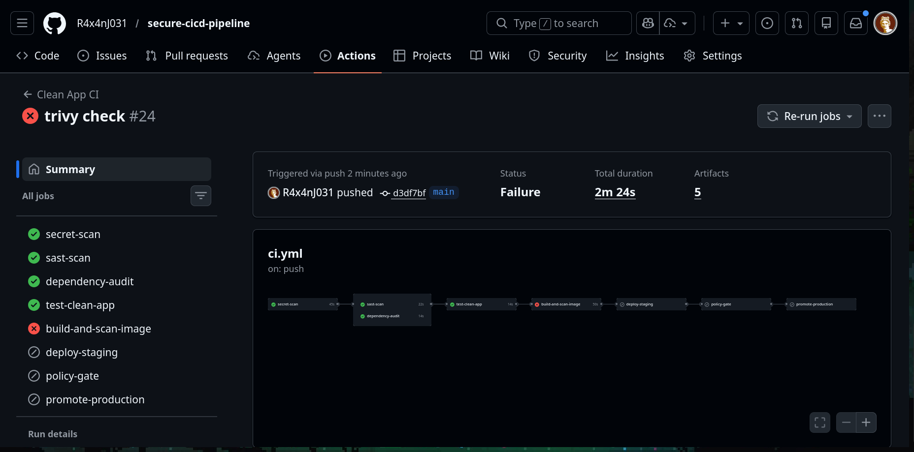

# Secure CI/CD Pipeline

A Product Security and DevSecOps portfolio project that demonstrates a secure software delivery pipeline end to end.

This repository shows how to:

- block insecure code before merge
- build and scan container artifacts
- generate an SBOM
- sign and verify images with keyless Cosign
- deploy to Kubernetes staging
- run DAST against the live app
- evaluate release policy with OPA
- require protected approval before simulated production promotion

## What This Project Demonstrates

- CI/CD ownership in GitHub Actions
- secure SDLC guardrails
- SAST, SCA, secrets scanning, DAST
- supply-chain security with SBOMs and signed artifacts
- Kubernetes-based staging and production promotion simulation
- policy-based release decisions instead of scan-only reporting

## Architecture

```text
Developer Push / Pull Request
        ↓
GitHub Actions CI
        ↓
Secrets Scan (Gitleaks)
        ↓
SAST (Semgrep)
        ↓
Dependency Audit (npm audit)
        ↓
Tests
        ↓
Docker Build
        ↓
SBOM Generation (Syft)
        ↓
Container Scan (Trivy)
        ↓
Image Push to GHCR
        ↓
Keyless Signing + Verification (Cosign)
        ↓
Kubernetes Staging Deploy
        ↓
DAST (OWASP ZAP Baseline)
        ↓
OPA Policy Gate
        ↓
Protected Production Promotion
```

## Toolchain

| Area | Tool |
| --- | --- |
| CI/CD | GitHub Actions |
| App | Node.js / Express |
| Containers | Docker |
| Registry | GitHub Container Registry (`ghcr.io`) |
| Secrets scanning | Gitleaks |
| SAST | Semgrep |
| Dependency audit | `npm audit` |
| SBOM | Syft |
| Container scanning | Trivy |
| Signing | Cosign keyless signing |
| Staging / production simulation | Kubernetes (`kind`) |
| DAST | OWASP ZAP |
| Policy as code | OPA / Rego |

## Pipeline Stages

### 1. PR and push security gates

The workflow starts on:

- `pull_request`
- `push` to `main`

Early checks block insecure changes before the delivery stages begin.

### 2. Secrets scanning

`Gitleaks` scans the repository for committed secrets and fails the workflow if leaks are detected.

### 3. SAST

`Semgrep` scans application source code for insecure patterns. This project includes custom JavaScript rules for dangerous patterns such as `eval(...)`.

### 4. Dependency security

`npm audit` checks application dependencies for known vulnerabilities and enforces a severity threshold.

### 5. Test gate

The clean app must still pass its test suite before artifact creation continues.

### 6. Artifact build and supply-chain checks

The pipeline:

- builds a Docker image
- generates an SBOM with `Syft`
- scans the image with `Trivy`
- pushes the image to `ghcr.io`
- signs it with keyless `Cosign`
- verifies the signature against the GitHub Actions workflow identity

### 7. Kubernetes staging deployment

The pipeline creates an ephemeral `kind` cluster in CI, deploys the exact SHA-tagged image, waits for rollout, and smoke-tests the `/health` endpoint.

### 8. DAST

`OWASP ZAP` baseline scan runs against the live staging deployment and exports HTML, JSON, Markdown, and console-summary evidence.

### 9. Policy gate

OPA evaluates a normalized security summary built from the pipeline artifacts. Promotion is denied if release policy conditions are not met.

### 10. Protected production promotion

If policy passes, the pipeline promotes the same SHA-tagged image into a simulated production environment. GitHub Environments protection rules can require approval before this step executes.

## Security Controls Implemented

- secrets management guardrail with `Gitleaks`
- SAST guardrail with `Semgrep`
- dependency risk detection with `npm audit`
- SBOM generation with `Syft`
- container vulnerability scanning with `Trivy`
- artifact signing and verification with `Cosign`
- staging DAST with `OWASP ZAP`
- release policy with `OPA`
- manual approval gate through GitHub `production` environment protection rules

## Repository Structure

```text
.
├── .github/workflows/ci.yml
├── apps/clean-app
├── docs/
│   └── container-vulnerability-triage.md
├── k8s/
│   ├── base/
│   └── overlays/
│       ├── local/
│       ├── staging/
│       └── production/
├── policies/
│   └── release.rego
├── reports/
├── scripts/
│   └── build-policy-input.sh
└── semgrep-rules/
```

## Kubernetes Layout

- `k8s/base`: shared namespace, deployment, and service
- `k8s/overlays/local`: local learning deployment using `clean-app:local`
- `k8s/overlays/staging`: registry-backed staging deployment
- `k8s/overlays/production`: simulated production promotion with production-specific patching

## Policy Model

OPA evaluates a normalized JSON input built from pipeline artifacts.

Current deny conditions:

- SBOM missing
- Trivy reports any `HIGH` or `CRITICAL` vulnerabilities after ignore processing
- ZAP reports any `FAIL-NEW` findings
- artifact signing/verification not completed
- staging health verification not completed

Policy source:

- [policies/release.rego](/home/raxan/Documents/secure-cicd-pipeline/policies/release.rego)

## Local Development

### Run the app

```bash
cd apps/clean-app
npm install
npm test
npm start
```

Health check:

```bash
curl http://127.0.0.1:3000/health
```

### Build the container

```bash
docker build -t clean-app:local ./apps/clean-app
docker run --rm -p 3000:3000 clean-app:local
```

### Local Kubernetes deployment

```bash
kind create cluster --name secure-cicd
kind load docker-image clean-app:local --name secure-cicd
kubectl apply -k k8s/overlays/local
kubectl port-forward -n secure-cicd service/clean-app 8080:80
curl http://127.0.0.1:8080/health
```

## Notable Triage Example

This project includes a documented example of container vulnerability triage:

- [container-vulnerability-triage.md](/home/raxan/Documents/secure-cicd-pipeline/docs/container-vulnerability-triage.md)

It records how base-image vulnerabilities surfaced in `Trivy`, how the runtime image was hardened, and how narrowly scoped temporary exceptions were documented rather than weakening the entire security gate.

## Workflow Evidence

### Successful full pipeline

The end-to-end pipeline completes with:

- security checks passing
- staging deployment succeeding
- policy gate approval
- protected production promotion



### Production approval gate

The production environment is protected with GitHub Environments so release promotion can require explicit approval before execution.



### Intentional failed security gate

This screenshot shows a controlled failure used to demonstrate that the pipeline blocks insecure artifacts during the `build-and-scan-image` stage.



## Interview Summary

You can summarize this project like this:

> I built a secure CI/CD pipeline in GitHub Actions that enforces secrets scanning, SAST, dependency auditing, SBOM generation, container image scanning, keyless artifact signing, Kubernetes staging deployment, DAST with ZAP, OPA policy gates, and protected production promotion.

## Future Improvements

- harden application headers based on current ZAP warnings
- add a second intentionally vulnerable app such as OWASP Juice Shop for contrast
- add artifact attestations / provenance
- extend policy inputs with richer signature and deployment metadata
- add screenshots and workflow evidence to this README
